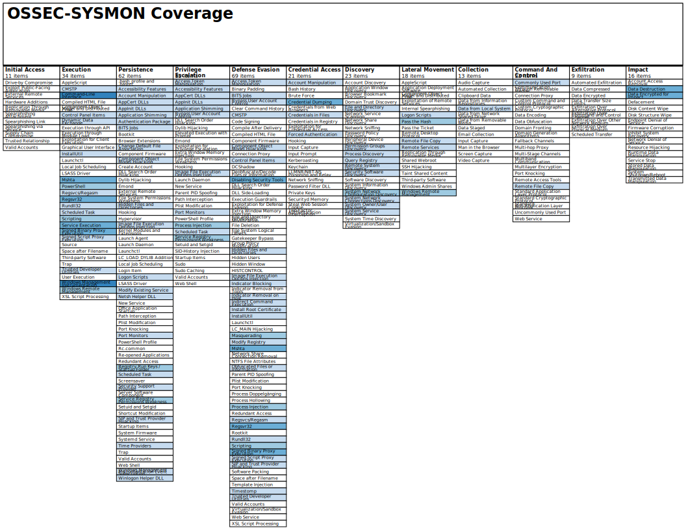

# ossec-sysmon

## Added MITRE ATT&CK tags to rules files

[As outlined here in my blog](https://benheater.com/wazuh-mapping-sysmon-events-to-mitre-attck-ids/), I edited each rules file and added the following tags:

```xml
<mitre>
  <id>T####</id>
</mitre>
```

This is a convenient way to visualize your events data by ATT&CK ID on the dashboard and adds more context (and vanity) beyond some text in the description and group tags. Also, as detailed in my blog post, I renamed the individual rules files, because of the way the Wazuh Manager loads rules files in numerical order. Keeping them in the order as found in the original repo was causing the Manager to fail to load, since some files were loading by precedence of file name and breaking some dependencies on group names and rule IDs.

## A Ruleset to enhance detection capabilities of Ossec using Sysmon

See the following post to see how this ruleset can help you detect Emotet and other malicious document malware.

https://laskowski-tech.com/2018/11/28/detecting-emotet-and-other-downloader-malware-with-ossec-wazuh/




The 0805-sysmon-modular rules map to the Sysmon configuration by olafhartong and are tagged to the MITRE ATT&CK framework.
You can find that at the following link.

https://github.com/olafhartong/sysmon-modular
